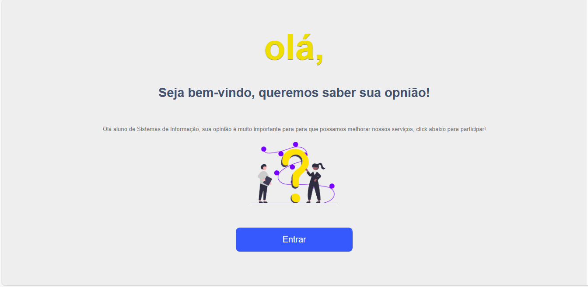
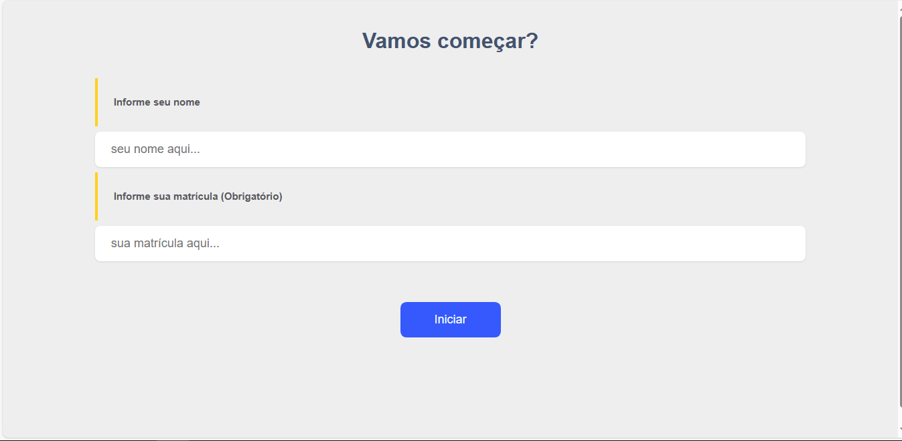
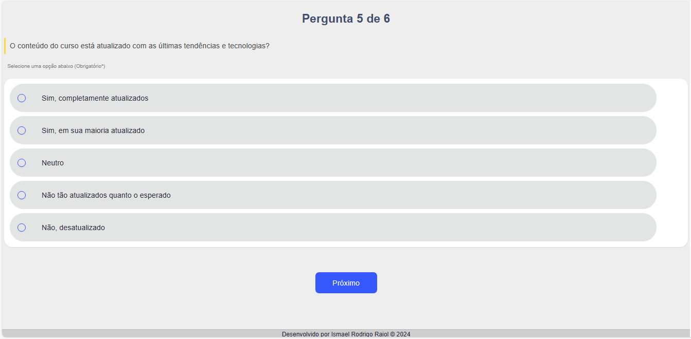
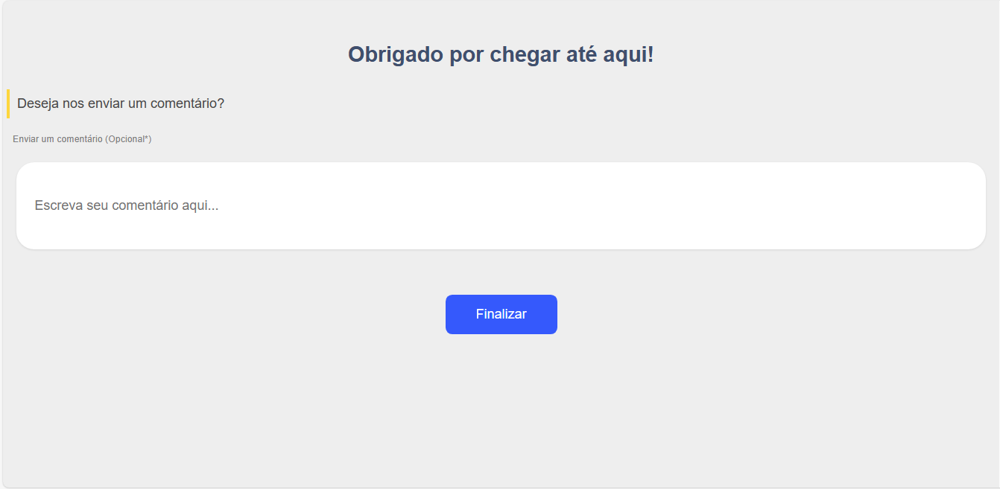

# Feedback-BSI

Este projeto está em desenvolvimento por Ismael Rodrigo Raiol (desenvolvido com Vue 3 em Vite).
Para acessa a página de dashboard acesse: https://github.com/ismaelrodrigoraiol/dashboard-feedbackBSI ou http://dashboard-feedbackbsi.netlify.app

## IDE recomendada

[VSCode](https://code.visualstudio.com/) + [Volar](https://marketplace.visualstudio.com/items?itemName=Vue.volar) (and disable Vetur) + [TypeScript Vue Plugin (Volar)](https://marketplace.visualstudio.com/items?itemName=Vue.vscode-typescript-vue-plugin).

## Configuração

Veja [Vite Configuration Reference](https://vitejs.dev/config/).

## Configuração do projeto

```sh
npm install i
```

### Compilar e recarregar para desenvolvimento

```sh
npm run dev
```

### Compilar e reproduzir

```sh
npm run build
```
## Screenshot






## Documento de visão

Feedback-BSI
Documento de Visão

1. Introdução
1.1 Escopo
O projeto Feedback-BSI visa desenvolver uma página web interativa que 
permite a coleta de respostas dos alunos do curso de Sistemas de Informação, com o 
objetivo de avaliar a satisfação do público-alvo. A página utilizará JavaScript, HTML, e 
CSS para interação do usuário, enquanto os dados das respostas serão armazenados 
e gerenciados pelo banco de dados Firebase. Além disso, será implementado um painel 
de visualização (dashboard) para análise das respostas coletadas.
1.2 Objetivo
Desenvolver uma plataforma interativa que permita coletar respostas dos alunos 
do curso de Sistemas de Informação para avaliação de satisfação, armazenando as 
respostas em tempo real em um banco de dados e disponibilizando um painel de 
visualização para análise e tomada de decisões.
1.3 Funcionalidades
- Carregamento dinâmico das perguntas da avaliação a partir do banco de dados.
- Possibilidade de os alunos responderem selecionando opções pré-definidas e 
inserindo comentários adicionais.
- Envio das respostas dos alunos para o banco de dados Firebase via API.
- Desenvolvimento de um painel de visualização para acesso e análise das respostas 
coletadas.
- Apresentação, no painel de visualização, do total de usuários que responderam a 
avaliação, bem como o número de respostas por pergunta e comentários enviados.
1.4 Tecnologias Utilizadas
- JavaScript: Lógica de interação da página web.
- HTML: Estruturação do conteúdo da página.
- CSS: Design e estilo da página.
- Vue.js: para o desenvolvimento da interface de usuário.
- Vite: como um build tool para o desenvolvimento rápido e eficiente.
- Firebase: Banco de dados para armazenamento das respostas dos alunos.
- Firebase API: Comunicação entre a página web e o banco de dados Firebase.
- GitHub: Hospedagem do código-fonte do projeto.
- Netlify: Ferramenta para fazer o deploy do código-fonte e hospedar a página web.
1.5 Público-Alvo
O público-alvo inclui alunos, professores, e a equipe administrativa do curso de 
Sistemas de Informação que estarão envolvidos na coleta e análise das respostas.


## Documento Completo aqui:

https://drive.google.com/file/d/18bb3BJTTRoloN4ouDKnZzHz4FTQk5axq/view?usp=sharing
